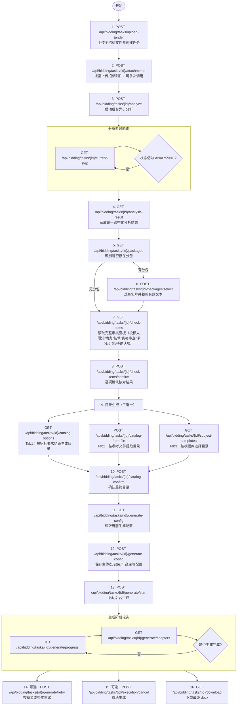

# 智能标书系统需求文档

> **项目名称**: ERP 智能标书生成系统
> **后端**: Flask + SQLAlchemy + MySQL + ChromaDB + MinIO
> **前端原型**: Vue 3 + Element Plus
> **生成日期**: 2026-06-18
> **更新日期**: 2026-06-26

---

## 一、项目概述

本项目通过 AI 解析招标文件，自动提取关键条款、评分标准和资格要求等结构化信息，辅助用户快速生成符合规范的高质量投标文件，减少人工翻阅时间、降低废标风险、提升标书质量。

### 核心模块四大块

| 模块 | 说明 |
|------|------|
| **标书生成** | 标书任务全生命周期管理：上传 → 分析 → 核对 → 目录生成 → 内容生成 → 下载 |
| **资料库** | 投标主体公司的资质文件管理 |
| **知识库** | RAG 知识库管理，供标书生成时检索引用的参考材料 |
| **模板库** | 预定义的标书目录结构模板 |

### 前端三步骤流程

根据前端原型（提示词），前端按三步推进：

```
分析（上传 → AI解析 → 选择包 → 展示解析结果）→ 核对（左右对照编辑）→ 生成（选择目录 → 配置 → 生成标书）
```

---

## 二、标书生成模块

### 2.1 任务列表

| 字段 | 说明 | 后端 API | 实现状态 |
|------|------|----------|----------|
| 文件名称 | 上传招标文件的名称 | `GET /api/bidding/tasks` | ✅ 已实现 |
| 状态 | 任务当前状态码 | 同上 | ✅ 已实现 |
| 进度 | 按百分比折算的进度值 | 同上 | ✅ 已实现 |
| 创建时间 | 任务创建时间 | 同上 | ✅ 已实现 |
| 操作栏 | 下载/删除/批量删除 | `DELETE /{id}` `/batch-delete` `/download` | ✅ 已实现 |

**状态流转**:
```
INIT(0%) → UPLOADED(10%) → ANALYZING → PACKAGE_PENDING → ANALYZED(20%) → CHECKED(30%) → CATALOG_CONFIRMED(40%) → GENERATING(41-99%) → GENERATED(100%)
```
允许状态: CANCELLED, FAILED

✅ 全部状态节点已实现

---

### 2.2 新增标书任务（流程细节）

前端入口：顶部三步骤条（`el-steps`），第一步亮起。不可点击跳转，仅通过底部按钮推进。

#### 步骤一：分析（Step 1）

**子页面 1 - 上传招标文件**

| 功能点 | 前端交互 | 后端 API | 实现状态 |
|--------|----------|----------|----------|
| 选择标书类型 | `el-radio-group` 三选一（GOODS/SERVICE/ENGINEERING） | 作为参数传入上传接口 | ✅ 已实现 |
| 文件上传区域 | `el-upload` 拖拽/点击上传 .pdf/.doc/.docx | `POST /api/bidding/tasks/upload-tender` | ✅ 已实现 |
| 已上传文件列表 | `el-table` 展示文件名、大小、删除按钮 | 前端维护 | ✅ 前端可对接 |
| 上传附件 | 非必填 | `POST /{task_id}/attachments` | ✅ 已实现 |
| 开始分析按钮 | 至少一个文件后启用 | 点击触发 | ✅ 已实现 |

**解析进度模态框**
- 点击"开始分析"后弹出 `el-dialog`，显示9步解析进度
  - 步骤：规范文件格式 → 通读投标须知 → 分析商务/技术条款 → 审查资格条件 → 识别废标风险 → 分析评分标准 → 分析附件内容 → 汇总全部信息
  - 每步状态：等待 → 加载中（`el-icon-loading`）→ 完成（`el-icon-circle-check`）
- 解析完成后自动关闭 → 进入选择包界面
- 后端调用: `POST /api/bidding/tasks/{task_id}/analyze` → 异步启动
- ✅ 后端已实现（ThreadPool 异步执行）

> ⚠ **注意**: 解析内容展示不做流式渲染，前端应轮询获取完整结果后统一展示。

**选择包界面**
- 若解析出 >1 个包：`el-radio-group` 展示包号、包名称、预算
- 若仅1个包：自动选中跳过
- 后端：`GET /{task_id}/packages` → `POST /{task_id}/packages/select`
- ✅ 已实现，包名已修复输出

**子页面 2 - AI 解析内容展示**

展示内容结构（对应 `GET /api/bidding/tasks/{task_id}/analysis-result`）：

| 卡片区域 | 展示组件 | 数据来源 | 实现状态 |
|---------|---------|---------|---------|
| ① 投标人须知 | `el-descriptions` 键值对（项目名称、编号、包号、预算、招标人、代理机构、领域、概况、中小企业、暗标） | analysis_result JSON | ✅ 已实现 |
| ② 商务需求 | `el-text` / 段落 | 同上 | ✅ 已实现 |
| ③ 技术要求 | `el-text` / 段落 | 同上 | ✅ 已实现 |
| ④ 资格审查 | `el-tabs` × 三 Tab（资格性/复合性/废标项），每项 `el-table` | 同上 | ✅ 已实现 |
| ⑤ 评分标准 | `el-tabs` × 两 Tab（商务/技术评分），`el-table`（评分项、评分标准、分数） | 同上 | ✅ 已实现 |

底部按钮：**"核对无误"** → 保存解析数据 → 步骤条切到第二步

#### 步骤二：核对（Step 2）

| 功能点 | 前端交互 | 后端 API | 实现状态 |
|--------|---------|---------|---------|
| 左侧展示 | 系统解析的完整审核面板（投标人须知/商务/技术/资格审查/评分标准/分包信息/待确认清单），所有字段可编辑 | `GET /{task_id}/check-items` | ✅ 已实现（返回复合 JSON） |
| 右侧文件预览 | 原始标书文件呈现（`iframe` / PDF.js），支持滚动 | `GET /{task_id}/tender-file`（需新增） | ⚠️ 后端暂无独立预览接口 |
| 左-右联动 | 点击左侧字段 → 右侧滚动到原文对应位置高亮2秒 | 前端锚点逻辑 | ❌ 前端需实现 |
| 编辑保存 | 每个字段可编辑为 `el-input`，保存/取消 | `POST /{task_id}/check-items/confirm` | ✅ 已实现 |
| 底部按钮 | "核对无误" → 保存所有编辑，步骤条切到第三步 | 同上 | ✅ 已实现 |

> **关于文件预览**：此功能对应前端 Step 2 核对阶段，左侧展示 AI 分析的核对项（投标人须知、商务/技术要求、资格审查、评分标准），右侧展示原始标书文件原文（`iframe` / PDF.js 渲染）。用户左侧逐项核对、编辑，右侧对照原文确认。当前后端缺少一个返回原始招标文件下载流/预览 URL 的专用端点，需补充 `GET /api/bidding/tasks/{task_id}/tender-file` 接口。

#### 步骤三：生成（Step 3）

**子页面 - 生成目录 + 配置**

| 功能点 | 前端交互 | 后端 API | 实现状态 |
|--------|---------|---------|---------|
| 目录生成 | `el-tabs` 三种模式 | 三个独立接口 | ✅ 已实现 |
| Tab1: 按评分点生成 | LLM 从分析结果生成目录（`el-tree` 带复选框） | `GET /{task_id}/catalog-options` | ✅ 已实现 |
| Tab2: 按参考格式生成 | 上传已有投标文件 → LLM 提取目录 | `POST /{task_id}/catalog-from-file` | ✅ 已实现 |
| Tab3: 按模板生成 | 弹框选择该主体公司下的模板 → 取模板目录 | `GET /{task_id}/subject-templates` | ✅ 已实现 |
| 目录确认 | 选中后提交 → CATALOG_CONFIRMED(40%) | `POST /{task_id}/catalog-confirm` | ✅ 已实现 |
| 生成配置（右侧表单） | 输出格式（Word/PDF）、封面开关、自动编号、页边距 | `POST /{task_id}/generate-config` | ✅ 已实现 |
| 主体/模型选择 | 主体公司 ID、模型类型 | 同上 | ✅ 已实现 |
| 知识库/产品库开关 | 是否启用 | 同上 | ✅ 已实现 |
| 生成标书 | 点击"生成标书草稿"→ 后台异步生成 | `POST /{task_id}/generate/start` | ✅ 已实现 |
| 进度追踪 | 章节级进度轮询 | `GET /{task_id}/generate/progress` `/chapters` | ✅ 已实现 |
| 下载 | 生成完成后提供下载链接 | `GET /{task_id}/download` | ✅ 已实现 |
| 重试 | 按章节或整本重新生成 | `POST /{task_id}/generate/retry` | ✅ 已实现 |
| 派生子任务 | 同一招标文件对不同主体生成多份标书 | `POST /{task_id}/derive` | ✅ 已实现 |
| 取消任务 | 生成中可取消 | `POST /{task_id}/execution/cancel` | ✅ 已实现 |

> **生成方式**：后台异步生成（非流式），前端轮询获取章节进度。不支持逐字/逐句流式输出。

### 2.3 多主体生成（派生任务）

同一招标文件可选择不同主体生成多份标书。

| 功能点 | 后端 API | 实现状态 |
|--------|---------|---------|
| 派生任务创建 | `POST /{task_id}/derive` | ✅ 已实现 |
| 共享资源机制 | `BiddingSharedResource` + `BiddingTenderAttachment` | ✅ 已实现 |

---

### 2.4 标书生成接口调用顺序

本节同时说明两层内容：

1. **前端调用接口的先后顺序**
2. **`generate/start` 内部真正执行的生成逻辑**

核心原则如下：

- 前序步骤全部保留，分析、核对、目录确认都是生成标书的必要前置条件。
- 招标主文件与招标附件统一进入分析，后续目录生成和正文生成都基于统一分析结果。
- `catalog-options` 仅允许调整 `tab1`，且 `tab1` 必须受招标文件要求约束；`tab2/tab3` 保持原有能力。
- 正文生成不是自由写作，而是严格围绕招标要求做结构化响应。
- 填充策略遵循“宁缺毋滥”，强要求内容若无有效依据可留白，不随意编造。

#### 2.4.1 外部接口顺序



#### 2.4.2 分阶段说明

| 阶段 | 主要接口 | 说明 |
|------|----------|------|
| 上传主文件 | `POST /upload-tender` | 创建任务并保存主招标文件 |
| 上传附件 | `POST /{id}/attachments` | 招标附件与主文件属于同一共享资源，可上传多个附件，后续与主文件一起进入统一分析 |
| 启动分析 | `POST /{id}/analyze` | 后台异步分析主文件 + 全部已上传附件，提取投标人须知、商务/技术要求、资格审查、评分标准等；若分析完成后新增附件，需重新分析才能纳入后续生成依据 |
| 读取分析结果 | `GET /{id}/analysis-result` | 返回统一结构化结果，作为后续核对、目录和生成的共同依据 |
| 分包处理 | `GET /{id}/packages`、`POST /{id}/packages/select` | 有分包时选择包号，并对主招标文件和全部附件统一按当前包号裁剪有效分析文本 |
| 核对确认（审核面板） | `GET /{id}/check-items`、`POST /{id}/check-items/confirm` | 返回复合结构（bidding_info/business/technical/qualification/scoring/packages/checklist），内部由各子模块从同一 analysis_result 组装；确认后写回 BiddingCheckItem 表，后续生成链路直接消费 |
| 目录选择 | `GET /catalog-options`、`POST /catalog-from-file`、`GET /subject-templates`、`POST /catalog-confirm` | 三种来源统一输出 `outline`，其中 `tab1` 受招标要求约束，`tab2/tab3` 保持既有逻辑 |
| 保存配置 | `GET/POST /generate-config` | 保存主体、知识库、产品库、篇幅等配置 |
| 启动生成 | `POST /generate/start` | 后台生成 `generation_plan`、逐章正文、覆盖矩阵和最终 docx |
| 进度/重试/取消 | `GET /generate/progress`、`GET /generate/chapters`、`POST /generate/retry`、`POST /execution/cancel` | 支持轮询、局部重试、整本重试和取消 |
| 下载结果 | `GET /download` | 下载带免责声明、封面、正文、缺失项清单和主体资料附件的 docx |

> **check-items 返回结构（v2 重构后）**：`GET /check-items` 不再返回扁平的 items 数组，而是返回包含 `bidding_info`、`business`、`technical`、`qualification`、`scoring`、`packages`、`checklist` 七个章节的复合 JSON。其中 `checklist` 保留原有扁平待确认项（含 category/severity/content/prep_guide/confirmed），用于前端逐项确认交互。各子章节数据从 `bidding_analysis_result` 表同一行记录的不同字段组装，无需额外查询。

#### 2.4.3 `generate/start` 内部执行顺序

`POST /api/bidding/tasks/{id}/generate/start` 不是直接“逐章调用模型写正文”，而是按以下顺序执行：

1. 校验前置条件：主体资料完整、目录已确认、生成配置已保存。
2. 读取统一分析上下文：包含主招标文件、招标附件、核对回写结果、分包裁剪结果。
   - 招标附件支持多份，分析阶段会与主招标文件统一汇总。
   - 若分析完成后又补传附件，需要重新执行分析，新的附件才会进入后续目录和正文生成依据。
3. 构建 `generation_plan`：
   - 将招标要求拆成原子要求项；
   - 将目录章节和叶子节点与要求项做匹配；
   - 为每个目标项标记 `FILL`、`REVIEW` 或 `LEAVE_BLANK`。
4. 逐章生成正文：
   - 有叶子节点时按叶子节点逐项响应；
   - 优先使用确认后的分析结果、主体资料、知识库、产品库证据；
   - 对强资料型章节，若没有可直接支撑的资料，则输出留白标记而不是编造内容。
5. 构建 `generation_coverage`：
   - 统计总要求数、已覆盖数、缺失数、覆盖率；
   - 记录缺失项、来源文件和来源依据。
6. 组装最终 docx：
   - 第 1 页：免责声明；
   - 第 2 页：固定封面，包含标的名称、项目编号、投标人名称、投标时间，有包号时写入包号；
   - 正文按确认目录输出；
   - 生成后附加“待人工补齐清单”；
   - 主体资料按章节相关性或附件章节插入。

#### 2.4.4 当前生成约束

| 约束项 | 当前规则 |
|--------|----------|
| 生成依据 | 以核对后的分析结果为主，辅以主体资料、知识库、产品库 |
| 目录约束 | 仅 `tab1` 可按招标要求收紧；`tab2/tab3` 保持现有接口语义 |
| 内容原则 | 招标文件要求什么，就在投标文件中响应什么 |
| 填充策略 | 宁缺毋滥，不随便编造 |
| 强要求缺失 | 对强要求且缺少有效依据的章节允许留白 |
| 原文提示 | 仅在“强要求 + 最终留白”时展示招标原文提示；已覆盖项、普通缺失项不展示原文 |
| 输出结果 | 生成后保留覆盖矩阵、缺失项清单、来源文件追踪 |

## 三、资料库模块

| 功能点 | 后端 API | 实现状态 |
|--------|---------|---------|
| 列表（名称、范围、文件数、完整度） | `GET /api/bidding/subjects` | ✅ 已实现 |
| 新增主体（公司名、信用编码、联系人、联系方式、地址、备注） | `POST /api/bidding/subjects` | ✅ 已实现 |
| 资料上传（营业执照/资质/法人身份证/财务报表/廉洁承诺书） | `POST /{subject_id}/materials` | ✅ 已实现 |
| 资料完整度校验 | 接口返回 `completeness` 字段 | ✅ 已实现 |
| 文件保存 | MinIO + ChromaDB 向量化 | ✅ 已实现 |
| 搜索筛选 | `?keyword=&status=` | ✅ 已实现 |

---

## 四、知识库模块

| 功能点 | 后端 API | 实现状态 |
|--------|---------|---------|
| 列表（名称、文件数、大小） | `GET /api/bidding/knowledge-bases` | ✅ 已实现 |
| 新增/编辑/删除 | `POST/PUT/DELETE /{id}` | ✅ 已实现 |
| 文件上传（批量 doc/docx/xls/xlsx/pdf） | `POST /{kb_id}/files` | ✅ 已实现 |
| 文件引用状态 | `PUT /{kb_id}/files/{file_id}` | ✅ 已实现 |
| 文件搜索 | `?keyword=` | ✅ 已实现 |
| ChromaDB 向量化 | 上传后自动切片写入 | ✅ 已实现（已修复写入失败问题） |
| 文件删除（同时清理 MySQL + ChromaDB） | `DELETE /{kb_id}/files/{file_id}` | ✅ 已实现 |

---

## 五、模板库模块

| 功能点 | 后端 API | 实现状态 |
|--------|---------|---------|
| 列表（名称、类型、描述、使用次数） | `GET /api/bidding/template-catalogs` | ✅ 已实现 |
| 新增（JSON 目录结构） | `POST /api/bidding/template-catalogs` | ✅ 已实现 |
| 编辑 | `PUT /{id}` | ✅ 已实现 |
| 删除 | `DELETE /{id}` | ✅ 已实现 |
| 使用计数 | `use_count` 自动递增 | ✅ 已实现 |

---

## 六、技术架构

| 组件 | 技术选型 | 实现状态 |
|------|----------|---------|
| Web 框架 | Flask + Flask-RESTX | ✅ 已实现 |
| Swagger 文档 | `/api/docs` 自动生成 | ✅ 已实现 |
| ORM | SQLAlchemy | ✅ 已实现 |
| 数据库 | MySQL（pymysql） | ✅ 已实现 |
| 向量数据库 | ChromaDB（REST API :18080 直连） | ✅ 已实现 |
| 对象存储 | MinIO（:29000） | ✅ 已实现 |
| LLM 集成 | 千问/DeepSeek/GPT-4o/GLM-4/Claude-3 | ✅ 已实现 |
| Embedding 模型 | 通义千问 text-embedding-v4 | ✅ 已实现 |
| 文档解析 | pptpython-docx + PyMuPDF(fitz) + PaddleOCR | ✅ 已实现 |
| 多路召回 | ChromaDB 向量检索 + MySQL FULLTEXT ngram + RRF 融合 | ✅ 已实现 |
| 解析缓存 | `doc_parse_cache` 表（MySQL） | ✅ 已实现 |
| 全文索引 | `doc_chunks` 表 FULLTEXT ngram | ✅ 已实现 |
| 生成质量保证 | 需求追踪矩阵 + 后校验（LLM-as-Judge） | ✅ 已实现 |
| 覆盖率报告 | 生成后产出覆盖率报告 | ✅ 已实现 |
| 后台任务 | ThreadPoolExecutor + 服务重启恢复 | ✅ 已实现 |
| 操作日志 | `OperationLog` 全流程记录 | ✅ 已实现 |

---

## 七、前端对接说明

### 7.1 全部 API 端点清单

**标书任务（`/api/bidding/tasks`）** — 27 个端点

| 端点 | 方法 | 描述 |
|------|------|------|
| `/upload-tender` | POST | 上传招标文件，创建任务 |
| `` | GET | 任务列表（分页 + 多条件筛选） |
| `/{task_id}` | GET | 任务详情 |
| `/{task_id}` | DELETE | 删除任务 |
| `/batch-delete` | POST | 批量删除 |
| `/{task_id}/current-step` | GET | 当前步骤 |
| `/{task_id}/derive` | POST | 派生任务 |
| `/{task_id}/analyze` | POST | 启动分析 |
| `/{task_id}/analysis-result` | GET | 分析结果 |
| `/{task_id}/packages` | GET | 分包列表 |
| `/{task_id}/packages/select` | POST | 选择包号 |
| `/{task_id}/check-items` | GET | 审核面板数据（复合结构：bidding_info/business/technical/qualification/scoring/packages/checklist） |
| `/{task_id}/check-items/confirm` | POST | 核对确认 |
| `/{task_id}/catalog-options` | GET | 目录候选方案 |
| `/{task_id}/catalog-from-file` | POST | Tab2：按参考文件提取目录 |
| `/{task_id}/subject-templates` | GET | Tab3：按模板库选择目录 |
| `/{task_id}/catalog-confirm` | POST | 确认目录 |
| `/{task_id}/generate-config` | GET/POST | 生成配置查询/保存 |
| `/{task_id}/generate/start` | POST | 启动生成 |
| `/{task_id}/generate/retry` | POST | 重新生成 |
| `/{task_id}/generate/progress` | GET | 生成进度 |
| `/{task_id}/generate/chapters` | GET | 章节状态 |
| `/{task_id}/executions` | GET | 执行记录 |
| `/{task_id}/execution/current` | GET | 当前执行 |
| `/{task_id}/execution/cancel` | POST | 取消执行 |
| `/{task_id}/download` | GET | 下载生成标书 |
| `/{task_id}/attachments` | GET/POST | 附件列表/上传 |
| `/{task_id}/attachments/{id}` | DELETE | 删除附件 |

**资料库（`/api/bidding/subjects`）** — 6 个端点

| 端点 | 方法 | 描述 |
|------|------|------|
| `` | GET/POST | 列表/新增 |
| `/{subject_id}` | GET/PUT/DELETE | 详情/更新/停用 |
| `/{subject_id}/materials` | GET/POST | 资料列表/上传 |
| `/{subject_id}/materials/{id}` | DELETE | 删除资料 |

**知识库（`/api/bidding/knowledge-bases`）** — 7 个端点

| 端点 | 方法 | 描述 |
|------|------|------|
| `` | GET/POST | 列表/新增 |
| `/{kb_id}` | GET/PUT/DELETE | 详情/更新/删除 |
| `/{kb_id}/files` | GET/POST | 文件列表/上传 |
| `/{kb_id}/files/{file_id}` | PUT/DELETE | 引用状态/删除 |

**模板库（`/api/bidding/template-catalogs`）** — 5 个端点

| 端点 | 方法 | 描述 |
|------|------|------|
| `` | GET/POST | 列表/新增 |
| `/{template_id}` | GET/PUT/DELETE | 详情/更新/删除 |

**系统（`/api/system` & `/api/health`）** — 4 个端点

| 端点 | 方法 | 描述 |
|------|------|------|
| `/api/health` | GET | 健康检查 |
| `/api/system/enums` | GET | 枚举常量 |
| `/api/system/task-runtime` | GET | 后台任务快照 |
| `/api/system/stats` | GET | 任务统计概览 |
| `/api/system/operation-logs` | GET | 操作日志分页查询 |

### 7.2 响应格式

所有接口统一使用 `success(data, message)` 或 `page_success(items, total, page_no, page_size)`，格式：

```json
{
    "code": 200,
    "message": "上传成功",
    "data": { ... }
}
```

### 7.3 核心请求/响应结构

| 模型 | 关键字段 | 说明 |
|------|---------|------|
| `TaskDetail` | `id, task_name, bid_type, status, progress, current_step, analysis_result, packages, ...` | 全字段约40+ |
| `AnalysisResult` | `overview, requirements, raw_text` | 结构化为须知/商务/技术/资格审查/评分 |
| `PackageItem` | `package_no, package_name` | 包号+包名 |
| `CheckItem` | `check_key, check_value, confirmed_flag` | 核对键值对+确认标记 |
| `CatalogOption` | `source_type, outline (tree), basis_text_preview` | 三种来源的目录树 |
| `GenerateConfig` | `subject_id, model_type, use_knowledge_base, use_product_library, catalog_generation_level, word_count_level` | 生成配置 |
| `ChapterProgress` | `chapter_no, title, progress, status` | 逐章进度百分比 |
| `SubjectItem` | `id, company_name, credit_code, completeness, ...` | 主体资料 |
| `KbItem` | `id, name, description, subject_id, total_files, total_size, ...` | 知识库 |
| `TemplateCatalog` | `id, template_name, bid_type, template_desc, catalog_content, use_count` | 模板目录 |

---

## 八、实现状态总结

### ✅ 已完全实现的功能

| 模块 | 关键能力 |
|------|---------|
| **标书生成** | 上传→分析→分包→核对→目录→配置→生成→下载 全生命周期 |
| **派生任务** | 同一招标文件对不同主体生成多份标书 |
| **资料库** | 主体 CRUD + 5种资质文件上传 + 完整度校验 |
| **知识库** | 目录管理 + 批量上传 + 引用开关 + ChromaDB 向量化 |
| **模板库** | 模板 CRUD + 使用计数 |
| **文件存储** | 双通道：MinIO 对象存储 + ChromaDB 向量库 |
| **后台任务** | 线程池 + 服务重启恢复 + 取消支持 |
| **章节级重试** | 支持按章节范围或整本重新生成 |
| **操作日志** | 全流程业务操作记录 |
| **Swagger 文档** | 全部接口有详尽注释（路径 `/api/docs`） |

### ⚠️ 需要完善的功能

| 功能点 | 关联模块 | 当前状态 | 说明 |
|--------|---------|---------|------|
| **文件预览接口** | 标书生成 → 核对步骤（Step 2） | ❌ 后端未实现 | 前端 Step 2 核对阶段需左右对照：左侧 AI 分析结果可编辑，右侧展示原始标书原文。需新增 `GET /api/bidding/tasks/{task_id}/tender-file` 返回原始招标文件的下载流或预览 URL |
| **左右联动高亮** | 标书生成 → 核对步骤（Step 2） | ❌ 前端需实现 | 点击左侧字段，右侧滚动到原文对应位置并高亮 |
| **解析进度模态框** | 标书生成 → 分析步骤（Step 1） | ❌ 前端需实现 | 调用分析后展示9步解析进度条，需对接 `POST /{task_id}/analyze` |
| **分包选择界面** | 标书生成 → 分析步骤（Step 1） | ❌ 前端需实现 | 解析完成后展示包号/包名供选择，对接 `GET /{task_id}/packages` |
| **Step 1 解析结果展示** | 标书生成 → 分析步骤（Step 1） | ❌ 前端需实现 | 按卡片/表格展示结构化的分析结果 |
| **Step 2 编辑交互** | 标书生成 → 核对步骤（Step 2） | ❌ 前端需实现 | 文字/表格字段旁有编辑图标，点击切换输入框 |
| **Step 3 目录树选择** | 标书生成 → 生成步骤（Step 3） | ❌ 前端需实现 | 三种模式目录树勾选/展示（Tab1: LLM生成 / Tab2: 上传文件提取 / Tab3: 模板选择） |
| **生成配置表单** | 标书生成 → 生成步骤（Step 3） | ❌ 前端需实现 | 输出格式、主体选择、模型选择等设置 |

### ✅ 无需实现的功能

| 功能点 | 原因 |
|--------|------|
| **流式生成输出** | 不需要逐字/逐句流式渲染，后端后台异步生成 + 前端轮询章节进度即可 |
| **分析步骤流式渲染** | AI 解析完成后整体返回，前端统一展示（可先展示骨架屏） |

---

## 九、目录结构

```
erp-bidding/
├── run.py                          # 启动入口
├── .env                            # 环境配置
├── requirements.txt                # Python 依赖
├── mysql/schema/                   # 建表 SQL 脚本
│   ├── 00_init_database.sql
│   └── 01_core_schema.sql
├── app/
│   ├── __init__.py                 # Flask 应用工厂
│   ├── config/__init__.py          # 配置（集成 MinIO/Chroma/LLM 等）
│   ├── core/
│   │   ├── enums.py                # 枚举常量
│   │   ├── extensions.py           # SQLAlchemy 扩展
│   │   └── response.py             # 统一响应格式
│   ├── domain/models.py            # ORM 模型定义（15张表）
│   ├── api/                        # Flask-RESTX 路由层
│   │   ├── tasks.py                # 标书任务接口（25个）
│   │   ├── subjects.py             # 主体公司接口（6个）
│   │   ├── knowledge_bases.py      # 知识库接口（7个）
│   │   ├── templates.py            # 模板库接口（5个）
│   │   └── system.py               # 系统接口（4个）
│   ├── service_modules/            # 业务逻辑层
│   │   ├── pipeline.py             # 聚合导出
│   │   ├── quality_assurance.py    # 生成质量保证（需求追踪矩阵+后校验+覆盖率报告）
│   │   ├── task_pipeline/
│   │   │   ├── workflow.py         # 流程总入口
│   │   │   ├── analysis.py         # 分析阶段
│   │   │   ├── catalog.py          # 目录阶段
│   │   │   ├── generate.py         # 生成阶段
│   │   │   ├── execution.py        # 后台执行管理
│   │   │   └── helpers.py          # 通用辅助函数
│   │   ├── subjects.py             # 资料库逻辑
│   │   ├── knowledge_bases.py      # 知识库逻辑
│   │   ├── templates.py            # 模板库逻辑
│   │   ├── storage.py              # 统一文件存储
│   │   ├── chroma_files.py         # ChromaDB 操作
│   │   └── common.py               # 公共工具
│   └── infrastructure/             # 基础设施层
│       ├── integrations.py         # MinIO/Chroma/LLM 适配器
│       ├── document_parser.py      # 版面感知文档解析（DOCX 标题/表格, PDF fitz+OCR）
│       ├── embedding_client.py     # 通义千问 text-embedding-v4 封装
│       ├── ocr_client.py           # PaddleOCR API 封装（异步提交+轮询+缓存）
│       ├── chroma_client.py        # ChromaDB REST API 直连封装
│       ├── multi_recall_engine.py  # 多路召回引擎（向量+关键词+RRF融合）
│       └── task_queue.py           # 线程池管理
```

---

## 十、问题记录

> **注意**: 以下问题均已在当前迭代中解决，保留记录作为历史参考。

### ChromaDB 写入失败问题（已解决）
- **问题**: `np.float_` 已在 NumPy 2.0 中移除，导致 chromadb 导入报错
- **原因**: 本地 numpy 版本 2.x 与 chromadb 本地客户端不兼容
- **方案**: 当前工程使用 HTTP Client 模式连接远端 Chromadb 服务（116.63.183.113:18080），已验证可正常工作
- **验证**: 通过 ChromaDB REST API 直连已验证可正常工作

### 文件预览缺失（待解决）
- **现状**: 前端 Step 2 核对阶段需要在右侧展示原始标书文件，但后端当前缺少接口
- **建议方案**:
  1. 在 `GET /api/bidding/tasks/{task_id}/tender-file` 新增端点，返回原始招标文件的下载流
  2. 前端用 `iframe` 或 PDF.js 嵌入渲染

### 标书提示词文件
- **文件位置**: `标书项目提示词.txt`（工程根目录）
- **用途**: 原始需求文档，包含完整的业务流程描述和技术方案要求。本需求文档从中提炼并随迭代更新。

---

> 全部 API 接口文档可通过 Swagger UI 访问：`http://127.0.0.1:23112/api/docs`

> 启动命令：lsof -ti :23112 | xargs kill -9; cd /Users/wangjun/Desktop/work/erp/code/erp-bidding && source .venv/bin/activate && python3 run.py

